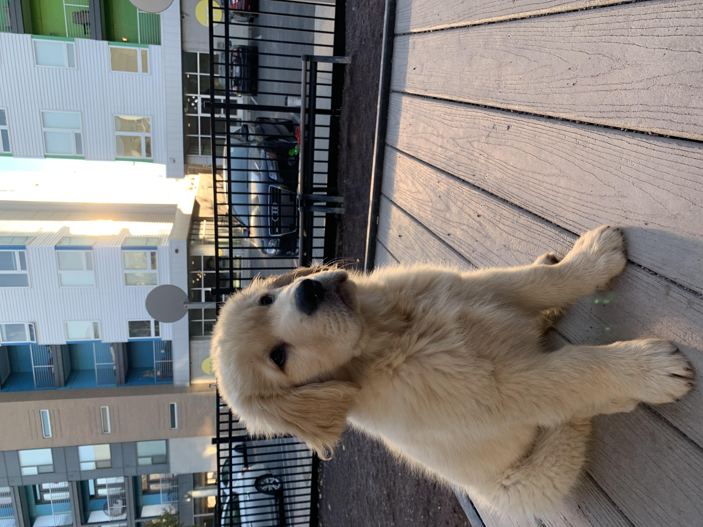

:::{.column-margin}
```{r}
#| echo: false
```
:::

## `r fontawesome::fa("map", fill = "#9B111E", a11y = "sem")` Indy

I live in Indianpolis, Indiana. It's a great city with an extremely relaxed vibe.

```{r}
#| echo: false

library(leaflet)
latitude = 39.7684
longitude = -86.1581

leaflet(height=2000, width=2000) %>%
  setView(
    lng = longitude,
    lat = latitude,
    zoom = 12) %>%
  addTiles() %>%
  addMarkers(
    lng=longitude,
    lat=latitude,
    popup="Indianapolis!"
    )

```

\
\


## `r fontawesome::fa("dog", fill = "#9B111E", a11y = "sem")` kevin

:::{.column-margin}
```{r}
#| echo: false
```
:::


::: {.grid}

::: {.g-col-4}
```{r}
#| echo: false
#| out-width: 100%
#| out-height: 100%

```
:::

::: {.g-col-8}
Hattie & I picked him up in September. He was 10 lbs. A month later he was 21 lbs. \
\
\
Kevin is a large guy (and a very good boy).
:::

:::


:::{.column-margin}
```{r}
#| echo: false
```
:::


## `r fontawesome::fa("football", fill = "#9B111E", a11y = "sem")` ball state

::: {.grid}

::: {.g-col-4}
```{r}
#| echo: false
#| out-width: 80%
#| out-height: 70%

```
:::

::: {.g-col-8}
I played football at Ball State University in Muncie, Indiana. I had a ton of fun. Seinor year, my teammates elected me a captain, which is an accomplishment I hold very dearly.
\
\
I loved living in Muncie. Most folks find this strange!
\
\
For a while, I was incredibly glad to be finished playing. I'm now ~5 years out and am beginning to miss it.
\
\
..or maybe I am just forgetting the injuries...
:::

:::
